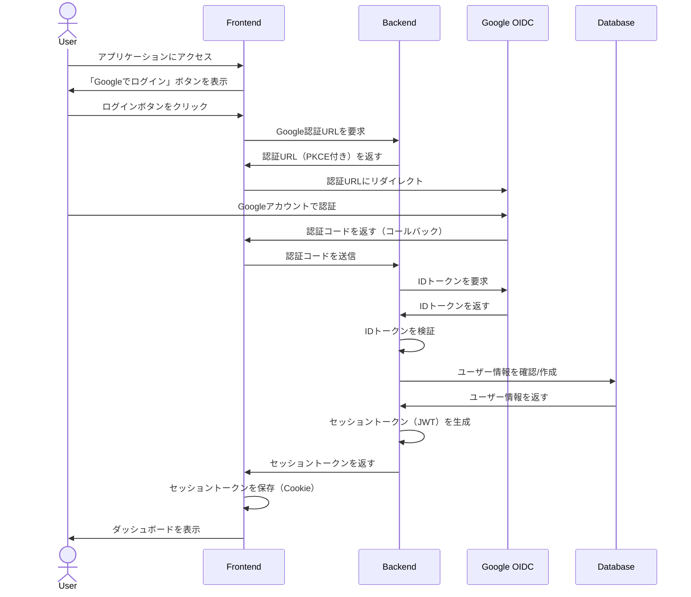
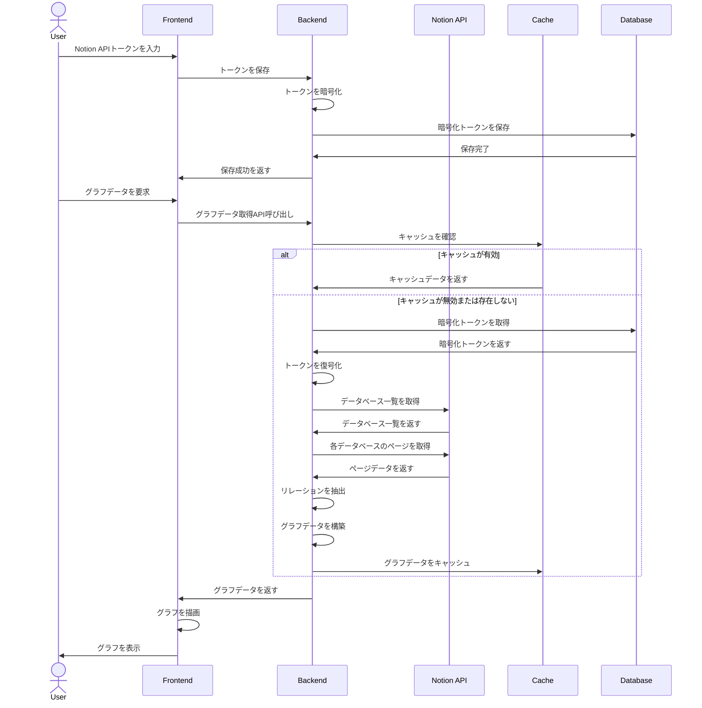
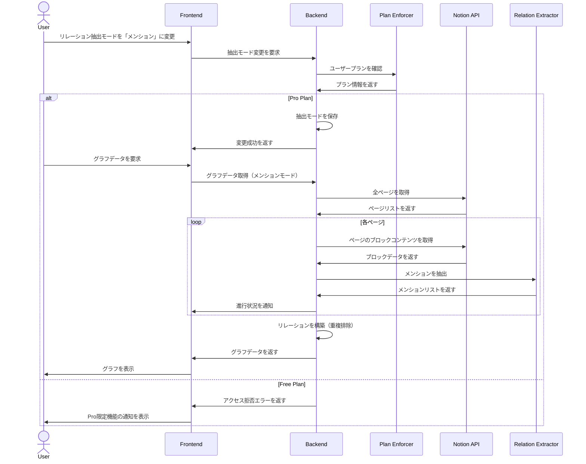
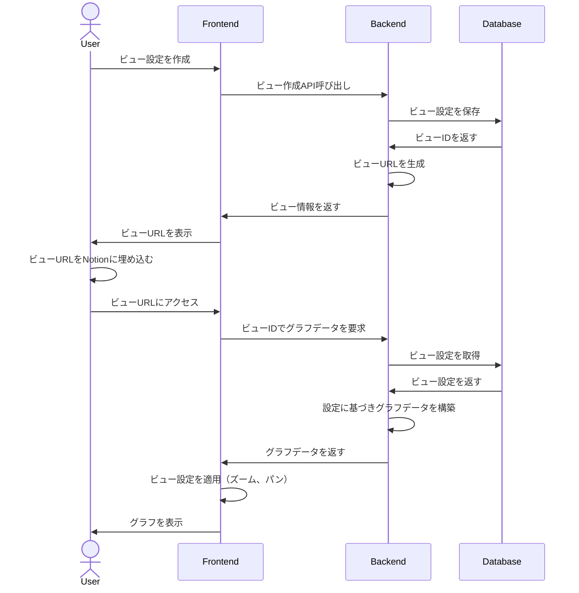
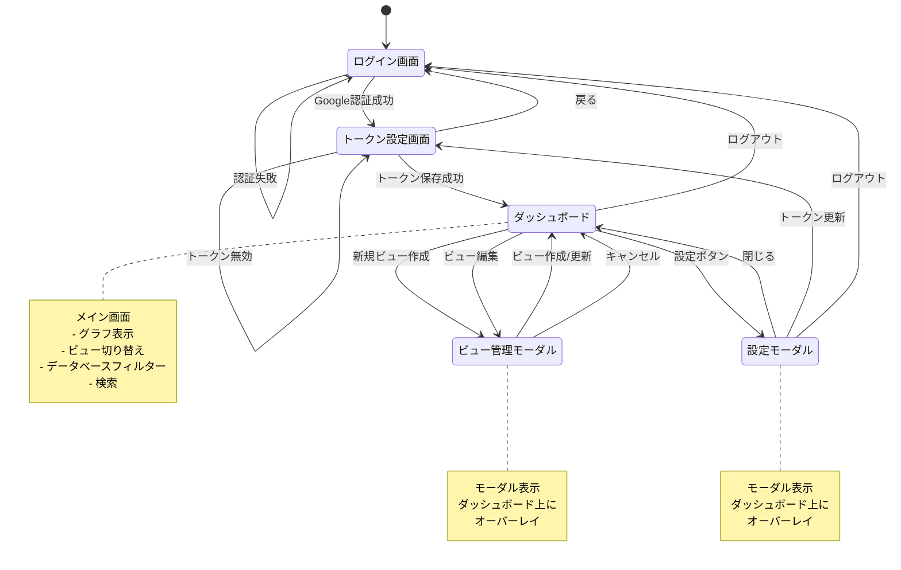
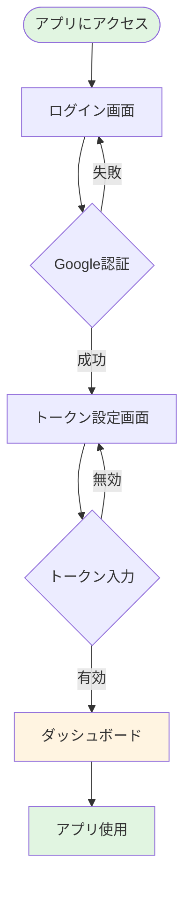
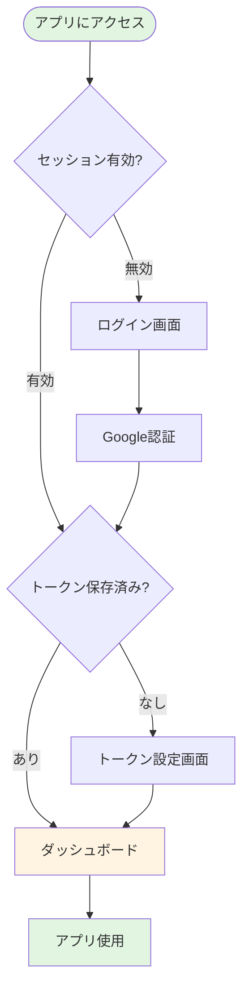
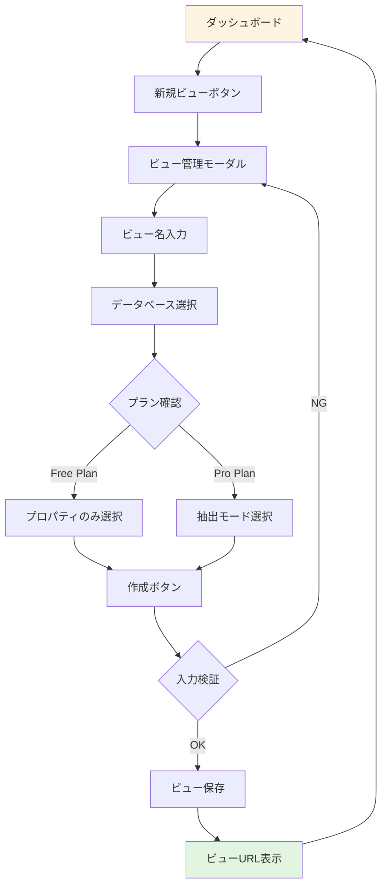
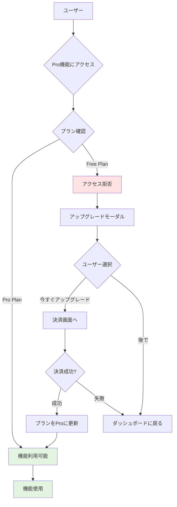
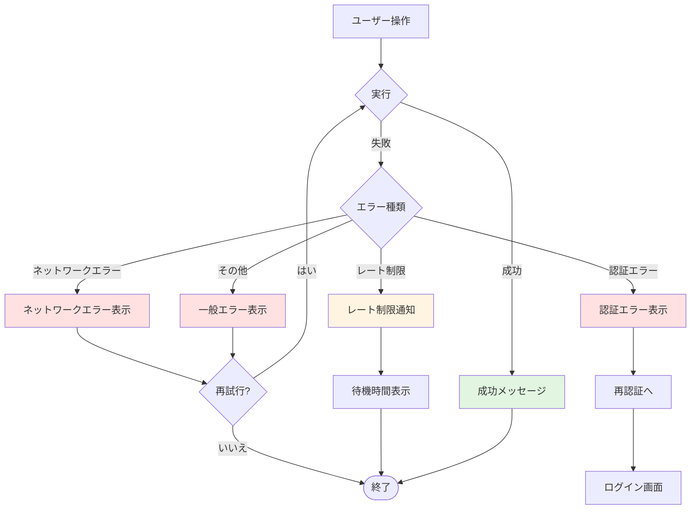

# 設計書

## 概要

notion-relation-viewは、Notionのページ間のリレーションを視覚的なグラフとして表示するWebアプリケーションです。本システムは、Notion APIを通じてページとリレーションデータを取得し、インタラクティブなグラフビューとして描画します。

### 主要な設計決定

1. **Webアプリケーションアーキテクチャ**: NotionのEmbed機能を活用し、すべてのプラットフォーム（Web、デスクトップ、モバイル）で動作するWebアプリケーションとして実装します。

2. **フロントエンド・バックエンド分離アーキテクチャ**: フロントエンドでグラフ描画とUI処理を行い、バックエンドでNotion API通信、トークン管理、データキャッシュを行います。これにより、セキュリティ、パフォーマンス、クロスプラットフォーム対応を実現します。

3. **グラフ描画ライブラリ**: 高性能なグラフ可視化のため、既存のライブラリ（例：D3.js、Cytoscape.js、vis.js）を使用します。

4. **サーバーサイドトークン管理**: Notion APIトークンはバックエンドのデータベースに暗号化して保存します。フロントエンドはセッションCookie（HTTPOnly）で認証し、トークンに直接アクセスしません。これにより、XSS攻撃からトークンを保護し、すべてのプラットフォーム（Webブラウザ、デスクトップアプリ）で同じトークンを使用できます。

5. **Google OIDC認証**: ユーザー認証はGoogle OpenID Connectのみを使用します。アプリケーション独自のパスワード管理を行わず、Googleの認証基盤を活用します。これにより、セキュリティリスクを軽減し、ユーザー体験を向上させます。

6. **データキャッシュ**: バックエンドでNotion APIから取得したデータをキャッシュし、API呼び出しを最小化します。これにより、レート制限を回避し、レスポンス速度を向上させます。

7. **リレーション抽出の柔軟性**: リレーションプロパティベースの抽出（Free/Pro共通）とページメンションベースの抽出（Pro限定）の両方をサポートします。Strategy パターンを使用して実装を切り替え可能にします。

8. **テーマ管理**: ライトモード、ダークモード、システム依存の3つのテーマオプションを提供します。ユーザーの好みや環境に合わせた視覚体験を実現します。

## アーキテクチャ

### システム構成

#### 認証フロー（Google OIDC）



#### グラフデータ取得フロー



#### ページメンション抽出フロー（Pro限定）



#### ビュー管理フロー



### レイヤー構成

#### フロントエンド

1. **UIレイヤー**: ユーザーインターフェース、イベントハンドリング、状態管理
2. **Graph Visualizerレイヤー**: グラフのレンダリング、レイアウト計算、インタラクション処理
3. **Theme Managerレイヤー**: テーマ管理、システムテーマ検出、テーマ切り替え
4. **API Clientレイヤー**: バックエンドAPIとの通信

#### バックエンド

1. **API Gatewayレイヤー**: フロントエンドからのリクエストを受け付け、認証・認可を行う
2. **Auth Providerレイヤー**: Google OIDC認証、セッション管理
3. **Notion API Clientレイヤー**: Notion APIとの通信、データ変換、エラーハンドリング
4. **Relation Extractorレイヤー**: リレーション抽出（プロパティベース、メンションベース）
5. **Plan Enforcerレイヤー**: プラン制限の適用、機能アクセス制御
6. **Cacheレイヤー**: データキャッシュ、レート制限管理
7. **Databaseレイヤー**: データ永続化、トークン管理

## コンポーネントとインターフェース

### UI設計

#### 画面構成

本アプリケーションは以下の主要画面で構成されます：

1. **ログイン画面**: Google OIDC認証
2. **トークン設定画面**: Notion API トークン入力
3. **ダッシュボード**: メインのグラフビュー
4. **ビュー管理画面**: ビュー設定の作成・編集
5. **設定画面**: テーマ、プラン情報

#### 画面遷移図



#### ユーザーフロー

**初回ユーザー（新規登録）**:



**既存ユーザー（再訪問）**:



**ビュー作成フロー**:



**Pro機能アクセスフロー**:



**エラーハンドリングフロー**:



#### 1. ログイン画面

```
+------------------------------------------+
|                                          |
|                                          |
|          [Notion Relation View]          |
|               [Logo/Icon]                |
|                                          |
|    Visualize your Notion connections     |
|                                          |
|     +---------------------------+        |
|     | [G] Sign in with Google   |        |
|     +---------------------------+        |
|                                          |
|                                          |
+------------------------------------------+
```

**要素**:
- アプリケーションロゴ（中央上部）
- キャッチコピー
- Googleログインボタン（目立つデザイン）
- シンプルで清潔なデザイン

#### 2. トークン設定画面

```
+------------------------------------------+
|  [←] Back                                |
+------------------------------------------+
|                                          |
|     Connect to Notion                    |
|                                          |
|     To visualize your Notion pages,      |
|     please provide your Integration      |
|     Token.                               |
|                                          |
|     +------------------------------+     |
|     | Notion Integration Token     |     |
|     | [____________________]       |     |
|     +------------------------------+     |
|                                          |
|     [?] How to get your token            |
|                                          |
|     [Cancel]           [Connect]         |
|                                          |
+------------------------------------------+
```

**要素**:
- 戻るボタン
- 説明文
- トークン入力フィールド（パスワード形式）
- ヘルプリンク（トークン取得方法）
- キャンセル・接続ボタン

#### 3. ダッシュボード（メイン画面）

```
+------------------------------------------------------------------+
| [Logo] Notion Relation View    [Search...] [☀️/🌙] [👤] [⚙️]    |
+------------------------------------------------------------------+
| Sidebar (280px)        | Graph Canvas                            |
|                        |                                         |
| Views                  |                                         |
| ├─ [+] New View        |                                         |
| ├─ 📊 My Workspace     |         [Graph Visualization]           |
| └─ 📊 Project Map      |                                         |
|                        |         • Nodes (pages)                 |
| Databases              |         • Edges (relations)             |
| ☐ Projects             |         • Interactive                   |
| ☑ Tasks                |                                         |
| ☑ Notes                |                                         |
|                        |                                         |
| Filters                |                                         |
| Extraction Mode: ▼     |                                         |
| • Property only        |                                         |
| • Mention only [Pro]   |                                         |
| • Both [Pro]           |                                         |
|                        |                                         |
+------------------------+-----------------------------------------+
| Status: 150 nodes, 230 edges | Zoom: 100% | FPS: 60            |
+------------------------------------------------------------------+
```

**レイアウト**:
- **ヘッダー（固定）**:
  - ロゴ・アプリ名（左）
  - グローバル検索バー（中央）
  - テーマ切り替えボタン（右）
  - ユーザーメニュー（右）
  - 設定ボタン（右）

- **サイドバー（280px、リサイズ可能）**:
  - ビューリスト
  - データベースフィルター（チェックボックス）
  - リレーション抽出モード選択
  - 検索フィルター

- **グラフキャンバス（メイン）**:
  - インタラクティブなグラフ表示
  - ズーム・パン操作
  - ノードクリックでNotionページを開く

- **ステータスバー（固定）**:
  - ノード数・エッジ数
  - ズームレベル
  - FPS表示

#### 4. ビュー管理画面（モーダル）

```
+------------------------------------------+
| Create New View                      [×] |
+------------------------------------------+
|                                          |
| View Name                                |
| [_____________________________]          |
|                                          |
| Select Databases                         |
| ☑ Projects                               |
| ☑ Tasks                                  |
| ☐ Notes                                  |
| ☐ Archive                                |
|                                          |
| Relation Extraction Mode                 |
| ○ Property only                          |
| ○ Mention only [Pro Badge]               |
| ○ Both [Pro Badge]                       |
|                                          |
| [Cancel]                  [Create View]  |
|                                          |
+------------------------------------------+
```

**要素**:
- ビュー名入力
- データベース選択（複数選択可能）
- リレーション抽出モード選択
- Pro機能にはバッジ表示
- キャンセル・作成ボタン

#### 5. 設定画面（モーダル）

```
+------------------------------------------+
| Settings                             [×] |
+------------------------------------------+
| Appearance                               |
|   Theme                                  |
|   ○ Light                                |
|   ○ Dark                                 |
|   ● System                               |
|                                          |
| Account                                  |
|   Email: user@example.com                |
|   Plan: Free [Upgrade to Pro]            |
|                                          |
| Notion Integration                       |
|   Token: ••••••••••••••                  |
|   [Update Token]                         |
|                                          |
| About                                    |
|   Version: 1.0.0                         |
|   [Documentation] [Support]              |
|                                          |
| [Close]                                  |
+------------------------------------------+
```

**セクション**:
- **Appearance**: テーマ設定
- **Account**: ユーザー情報、プラン
- **Notion Integration**: トークン管理
- **About**: バージョン、ドキュメント

#### コンポーネント階層

```
App
├── AuthProvider
│   └── LoginScreen
│       └── GoogleLoginButton
├── MainLayout
│   ├── Header
│   │   ├── Logo
│   │   ├── SearchBar
│   │   ├── ThemeToggle
│   │   └── UserMenu
│   ├── Sidebar
│   │   ├── ViewList
│   │   │   ├── ViewItem
│   │   │   └── NewViewButton
│   │   ├── DatabaseFilter
│   │   │   └── DatabaseCheckbox
│   │   └── ExtractionModeSelector
│   ├── GraphCanvas
│   │   ├── GraphRenderer
│   │   ├── NodeComponent
│   │   └── EdgeComponent
│   └── StatusBar
├── ViewModal
│   ├── ViewForm
│   └── DatabaseSelector
└── SettingsModal
    ├── ThemeSettings
    ├── AccountSettings
    └── NotionSettings
```

#### 状態管理

```typescript
// グローバル状態
interface AppState {
  // 認証
  user: User | null;
  isAuthenticated: boolean;

  // Notion接続
  notionConnected: boolean;

  // グラフデータ
  graphData: GraphData | null;
  selectedDatabases: string[];
  extractionMode: RelationExtractionMode;

  // UI状態
  theme: ThemeMode;
  sidebarOpen: boolean;
  activeView: View | null;

  // モーダル
  viewModalOpen: boolean;
  settingsModalOpen: boolean;

  // 検索・フィルター
  searchQuery: string;
  highlightedNodes: string[];
}
```

#### レスポンシブデザイン

**デスクトップ（1024px以上）**:
- サイドバー表示
- 全機能利用可能

**タブレット（768px - 1023px）**:
- サイドバーは折りたたみ可能
- ハンバーガーメニュー

**モバイル（767px以下）**:
- サイドバーはオーバーレイ表示
- 簡略化されたUI
- タッチ操作最適化

#### カラーパレット

**ライトモード**:
```
Background:    #FFFFFF
Surface:       #F5F5F5
Primary:       #2563EB (Blue)
Secondary:     #64748B (Slate)
Text Primary:  #1E293B
Text Secondary:#64748B
Border:        #E2E8F0
Success:       #10B981
Warning:       #F59E0B
Error:         #EF4444
```

**ダークモード**:
```
Background:    #0F172A
Surface:       #1E293B
Primary:       #3B82F6 (Blue)
Secondary:     #94A3B8 (Slate)
Text Primary:  #F1F5F9
Text Secondary:　#94A3B8
Border:        #334155
Success:       #34D399
Warning:       #FBBF24
Error:         #F87171
```

#### タイポグラフィ

```
Font Family:
  - Primary: Inter, system-ui, sans-serif
  - Monospace: 'Fira Code', monospace

Font Sizes:
  - Heading 1: 32px / 2rem
  - Heading 2: 24px / 1.5rem
  - Heading 3: 20px / 1.25rem
  - Body: 16px / 1rem
  - Small: 14px / 0.875rem
  - Tiny: 12px / 0.75rem

Line Heights:
  - Tight: 1.25
  - Normal: 1.5
  - Relaxed: 1.75
```

#### アイコン

**推奨アイコンライブラリ**: Lucide Icons または Heroicons

**主要アイコン**:
- ログイン: `LogIn`
- ユーザー: `User`
- 設定: `Settings`
- テーマ: `Sun` / `Moon`
- 検索: `Search`
- フィルター: `Filter`
- ビュー: `LayoutGrid`
- データベース: `Database`
- 追加: `Plus`
- 削除: `Trash`
- 編集: `Edit`
- 閉じる: `X`

#### アニメーション

**トランジション**:
```css
/* 標準 */
transition: all 0.2s ease-in-out;

/* テーマ切り替え */
transition: background-color 0.3s ease, color 0.3s ease;

/* モーダル */
transition: opacity 0.2s ease, transform 0.2s ease;
```

**ローディング**:
- スピナー（データ取得中）
- プログレスバー（メンション抽出中）
- スケルトンスクリーン（初期ロード）

#### アクセシビリティ

- **キーボードナビゲーション**: すべての操作をキーボードで実行可能
- **スクリーンリーダー**: ARIA属性の適切な使用
- **コントラスト比**: WCAG 2.1 AA基準（4.5:1以上）
- **フォーカスインジケーター**: 明確なフォーカス表示
- **エラーメッセージ**: 明確で具体的

### フロントエンドコンポーネント

#### 1. Frontend API Client

**責務**: バックエンドAPIとの通信を管理

**主要メソッド**:

```typescript
interface FrontendAPIClient {
  // Google OIDC認証
  initiateGoogleLogin(): Promise<void>;
  handleGoogleCallback(code: string): Promise<AuthResponse>;
  logout(): Promise<void>;

  // Notion APIトークンを保存
  saveNotionToken(token: string): Promise<void>;

  // グラフデータを取得（全データベース）
  getGraphData(): Promise<GraphData>;

  // データベース一覧を取得
  getDatabases(): Promise<Database[]>;

  // ビュー設定を作成
  createView(
    name: string,
    databaseIds: string[],
    settings: ViewSettings,
    extractionMode: RelationExtractionMode
  ): Promise<View>;

  // ビュー設定一覧を取得
  getViews(): Promise<View[]>;

  // 特定のビュー設定を取得
  getView(viewId: string): Promise<View>;

  // ビュー設定を更新
  updateView(
    viewId: string,
    name: string,
    databaseIds: string[],
    settings: ViewSettings,
    extractionMode: RelationExtractionMode
  ): Promise<View>;

  // ビュー設定を削除
  deleteView(viewId: string): Promise<void>;

  // ビュー設定に基づくグラフデータを取得
  getViewGraphData(viewId: string): Promise<GraphData>;

  // ユーザープラン情報を取得
  getUserPlan(): Promise<UserPlan>;
}
```

#### 2. Graph Visualizer

**責務**: グラフの描画、レイアウト、インタラクション処理

**主要メソッド**:

```typescript
interface GraphVisualizer {
  // グラフデータを初期化し、レイアウトを計算
  initialize(nodes: Node[], edges: Edge[]): void;

  // グラフを描画
  render(): void;

  // ノードの位置を更新
  updateNodePosition(nodeId: string, x: number, y: number): void;

  // ビューをパン
  pan(deltaX: number, deltaY: number): void;

  // ズームレベルを設定
  zoom(level: number): void;

  // ノードをハイライト
  highlightNodes(nodeIds: string[]): void;

  // 特定のノードにビューを中央揃え
  centerOnNode(nodeId: string): void;

  // ノードとエッジの表示/非表示を切り替え
  setVisibility(nodeIds: string[], visible: boolean): void;
}
```

**レイアウトアルゴリズム**:

- Force-directed layout（力指向グラフ）を使用
- ノード間の反発力とエッジの引力でバランスを取る
- 大規模グラフの場合は階層的レイアウトも検討

#### 3. Theme Manager

**責務**: アプリケーションのテーマ管理、システムテーマ検出、テーマ切り替え

**主要メソッド**:

```typescript
interface ThemeManager {
  // テーマを初期化（保存された設定またはシステム設定を読み込む）
  initialize(): void;

  // テーマを設定
  setTheme(mode: ThemeMode): void;

  // 現在のテーマを取得
  getCurrentTheme(): 'light' | 'dark';

  // システムテーマを検出
  detectSystemTheme(): 'light' | 'dark';

  // システムテーマ変更を監視
  watchSystemTheme(callback: (theme: 'light' | 'dark') => void): void;

  // テーマをローカルストレージに保存
  saveThemePreference(mode: ThemeMode): void;

  // 保存されたテーマ設定を読み込む
  loadThemePreference(): ThemeMode;
}
```

**テーマモード**:

```typescript
type ThemeMode = 'light' | 'dark' | 'system';
```

**実装詳細**:

- システムテーマ検出: `window.matchMedia('(prefers-color-scheme: dark)')`
- テーマ適用: CSSカスタムプロパティ（CSS Variables）を使用
- アクセシビリティ: WCAG 2.1 AA基準のコントラスト比を確保

#### 4. UI Controller

**責務**: ユーザーインターフェースの管理、イベント処理、状態管理

**主要メソッド**:

```typescript
interface UIController {
  // アプリケーションを初期化
  initialize(): Promise<void>;

  // Google認証を開始
  handleGoogleLogin(): Promise<void>;

  // Google認証コールバックを処理
  handleGoogleCallback(code: string): Promise<void>;

  // Notion APIトークン入力を処理
  handleTokenInput(token: string): Promise<void>;

  // データ取得を開始
  fetchData(): Promise<void>;

  // ビュー設定を作成
  createView(
    name: string,
    databaseIds: string[],
    extractionMode: RelationExtractionMode
  ): Promise<void>;

  // ビュー設定を選択
  selectView(viewId: string): Promise<void>;

  // ビュー設定を更新
  updateView(
    viewId: string,
    name: string,
    databaseIds: string[],
    extractionMode: RelationExtractionMode
  ): Promise<void>;

  // ビュー設定を削除
  deleteView(viewId: string): Promise<void>;

  // ビューURLを取得
  getViewUrl(viewId: string): string;

  // 検索クエリを処理
  handleSearch(query: string): void;

  // データベースフィルターを適用
  applyDatabaseFilter(databaseIds: string[]): void;

  // ノードクリックを処理
  handleNodeClick(nodeId: string): void;

  // テーマを変更
  handleThemeChange(mode: ThemeMode): void;

  // 進行状況を表示
  showProgress(current: number, total: number): void;

  // エラーを表示
  showError(error: Error): void;

  // Pro機能へのアクセス試行を処理
  handleProFeatureAccess(featureName: string): void;
}
```

**認証フロー**:

1. 初回アクセス時、「Googleでログイン」ボタンを表示
2. ユーザーがボタンをクリックし、Google OIDCフローを開始
3. Googleで認証完了後、コールバックURLにリダイレクト
4. バックエンドでIDトークンを検証し、ユーザー情報を取得
5. 初回ログインの場合、新規ユーザーアカウントを作成し、Free_Planを割り当て
6. セッショントークンを発行し、Notion Integration Token入力画面を表示
7. トークンを入力し、バックエンドに保存
8. グラフビューを表示

### バックエンドコンポーネント

#### 1. API Gateway

**責務**: フロントエンドからのリクエストを受け付け、認証・認可を行う

**主要エンドポイント**:

```typescript
// 認証関連（Google OIDC）
GET    /api/auth/google/login     // Google OIDCログインURLを取得
POST   /api/auth/google/callback  // Google認証コールバック処理
POST   /api/auth/logout           // ユーザーログアウト
GET    /api/auth/me               // 現在のユーザー情報を取得

// Notionトークン管理
POST   /api/notion/token          // Notionトークンを保存
GET    /api/notion/token/verify   // Notionトークンを検証

// グラフデータ
GET    /api/graph/data            // グラフデータを取得（全データベース）
GET    /api/graph/databases       // データベース一覧を取得

// ビュー管理
POST   /api/views                 // ビュー設定を作成
GET    /api/views                 // ユーザーのビュー設定一覧を取得
GET    /api/views/:viewId         // 特定のビュー設定を取得
PUT    /api/views/:viewId         // ビュー設定を更新
DELETE /api/views/:viewId         // ビュー設定を削除
GET    /api/views/:viewId/data    // ビュー設定に基づくグラフデータを取得

// プラン管理
GET    /api/plan                  // ユーザーのプラン情報を取得
```

#### 2. Notion API Client

**責務**: Notion APIとの通信を管理し、ページとリレーションデータを取得する

**主要メソッド**:

```typescript
interface NotionAPIClient {
  // APIトークンを検証し、接続を確立
  authenticate(token: string): Promise<AuthResult>;

  // すべてのアクセス可能なデータベースを取得
  getDatabases(token: string): Promise<Database[]>;

  // 指定されたデータベースからページを取得
  getPages(token: string, databaseId: string): Promise<Page[]>;

  // すべてのアクセス可能なページを取得（データベース外も含む）
  getAllPages(token: string): Promise<Page[]>;

  // ページのブロックコンテンツを取得
  getPageBlocks(token: string, pageId: string): Promise<Block[]>;

  // バッチ処理でページデータを取得
  fetchPagesInBatch(token: string, pageIds: string[]): Promise<Page[]>;
}
```

**エラーハンドリング**:

- 無効なトークン: `InvalidTokenError`
- ネットワークエラー: `NetworkError`
- レート制限: `RateLimitError`
- 権限不足: `PermissionError`

#### 3. Relation Extractor

**責務**: ページ間のリレーションを抽出する（Strategy パターン）

**主要インターフェース**:

```typescript
interface RelationExtractor {
  // リレーションを抽出
  extractRelations(
    token: string,
    pages: Page[],
    mode: RelationExtractionMode
  ): Promise<Relation[]>;
}

type RelationExtractionMode = 'property' | 'mention' | 'both';

// プロパティベースの抽出（Free + Pro）
class PropertyRelationExtractor implements RelationExtractor {
  extractRelations(
    token: string,
    pages: Page[],
    mode: RelationExtractionMode
  ): Promise<Relation[]> {
    // ページのリレーションプロパティを解析
  }
}

// メンションベースの抽出（Pro限定）
class MentionRelationExtractor implements RelationExtractor {
  constructor(private notionClient: NotionAPIClient) {}

  extractRelations(
    token: string,
    pages: Page[],
    mode: RelationExtractionMode
  ): Promise<Relation[]> {
    // ページのブロックコンテンツを取得し、メンションを抽出
  }
}

// 統合抽出器
class CombinedRelationExtractor implements RelationExtractor {
  constructor(
    private propertyExtractor: PropertyRelationExtractor,
    private mentionExtractor: MentionRelationExtractor
  ) {}

  async extractRelations(
    token: string,
    pages: Page[],
    mode: RelationExtractionMode
  ): Promise<Relation[]> {
    if (mode === 'property') {
      return this.propertyExtractor.extractRelations(token, pages, mode);
    } else if (mode === 'mention') {
      return this.mentionExtractor.extractRelations(token, pages, mode);
    } else {
      // 両方を取得し、重複を排除
      const propertyRelations = await this.propertyExtractor.extractRelations(
        token,
        pages,
        'property'
      );
      const mentionRelations = await this.mentionExtractor.extractRelations(
        token,
        pages,
        'mention'
      );
      return this.deduplicateRelations([...propertyRelations, ...mentionRelations]);
    }
  }

  private deduplicateRelations(relations: Relation[]): Relation[] {
    // 重複を排除（sourcePageId + targetPageId の組み合わせで判定）
  }
}
```

#### 4. Plan Enforcer

**責務**: プラン制限の適用、機能アクセス制御

**主要メソッド**:

```typescript
interface PlanEnforcer {
  // ユーザーのプランを取得
  getUserPlan(userId: string): Promise<UserPlan>;

  // 機能へのアクセスを確認
  canAccessFeature(userId: string, feature: Feature): Promise<boolean>;

  // ビュー作成を確認
  canCreateView(userId: string): Promise<boolean>;

  // ノード数制限を適用
  applyNodeLimit(userId: string, nodes: Node[]): Node[];

  // リレーション抽出モードを確認
  canUseExtractionMode(userId: string, mode: RelationExtractionMode): Promise<boolean>;
}

type Feature =
  | 'export'
  | 'custom_theme'
  | 'advanced_filtering'
  | 'layout_algorithm'
  | 'mention_extraction';

interface UserPlan {
  plan: 'free' | 'pro';
  viewLimit: number | null; // null = 無制限
  nodeLimit: number | null; // null = 無制限
  features: Feature[];
}
```

#### 5. Auth Provider

**責務**: Google OIDC認証、セッション管理

**主要メソッド**:

```typescript
interface AuthProvider {
  // Google OIDCログインURLを生成
  getGoogleLoginUrl(): string;

  // Google認証コールバックを処理
  handleGoogleCallback(code: string): Promise<GoogleUser>;

  // IDトークンを検証
  verifyIdToken(idToken: string): Promise<GoogleUser>;

  // セッショントークンを生成
  createSession(user: User): Promise<SessionToken>;

  // セッションを検証
  validateSession(sessionToken: string): Promise<User>;

  // セッションを無効化
  logout(sessionToken: string): Promise<void>;

  // Notionトークンを暗号化
  encryptNotionToken(token: string): string;

  // Notionトークンを復号化
  decryptNotionToken(encryptedToken: string): string;
}

interface GoogleUser {
  email: string;
  name: string;
  picture: string;
}
```

**セキュリティ**:

- Google OIDCフロー: Authorization Code Flow with PKCE
- セッショントークンはJWT（JSON Web Token）
- NotionトークンはAES-256-GCMで暗号化し、鍵導出にはPBKDF2-HMAC-SHA256を使用
- HTTPOnly Cookieでセッション管理

#### 6. Cache Manager

**責務**: Notion APIから取得したデータをキャッシュし、API呼び出しを最小化

**主要メソッド**:

```typescript
interface CacheManager {
  // グラフデータをキャッシュに保存
  cacheGraphData(userId: string, data: GraphData, ttl: number): Promise<void>;

  // キャッシュからグラフデータを取得
  getGraphData(userId: string): Promise<GraphData | null>;

  // キャッシュを無効化
  invalidateCache(userId: string): Promise<void>;

  // キャッシュの有効期限を確認
  isCacheValid(userId: string): Promise<boolean>;
}
```

**キャッシュ戦略**:

- TTL（Time To Live）: 15分
- ユーザーごとにキャッシュを分離
- データ更新時にキャッシュを無効化

#### 7. Database Service

**責務**: データベースへのアクセスを管理

**主要メソッド**:

```typescript
interface DatabaseService {
  // ユーザーを作成（Google認証情報から）
  createUser(email: string, name: string, picture: string): Promise<User>;

  // ユーザーを取得
  getUser(userId: string): Promise<User | null>;

  // メールアドレスでユーザーを取得
  getUserByEmail(email: string): Promise<User | null>;

  // Notionトークンを保存
  saveNotionToken(userId: string, encryptedToken: string): Promise<void>;

  // Notionトークンを取得
  getNotionToken(userId: string): Promise<string | null>;

  // ビュー設定を作成
  createView(
    userId: string,
    name: string,
    databaseIds: string[],
    settings: ViewSettings,
    extractionMode: RelationExtractionMode
  ): Promise<View>;

  // ユーザーのビュー設定一覧を取得
  getViews(userId: string): Promise<View[]>;

  // 特定のビュー設定を取得
  getView(viewId: string): Promise<View | null>;

  // ビュー設定を更新
  updateView(
    viewId: string,
    name: string,
    databaseIds: string[],
    settings: ViewSettings,
    extractionMode: RelationExtractionMode
  ): Promise<View>;

  // ビュー設定を削除
  deleteView(viewId: string): Promise<void>;

  // ユーザーのプラン情報を取得
  getUserPlan(userId: string): Promise<UserPlan>;

  // ユーザーのプランを更新
  updateUserPlan(userId: string, plan: 'free' | 'pro'): Promise<void>;
}
```

## データモデル

### フロントエンド

#### Node（ノード）

```typescript
interface Node {
  id: string; // NotionページID
  title: string; // ページタイトル
  databaseId: string; // 所属するデータベースID
  x: number; // グラフ上のX座標
  y: number; // グラフ上のY座標
  visible: boolean; // 表示/非表示フラグ
}
```

#### Edge（エッジ）

```typescript
interface Edge {
  id: string; // エッジの一意ID
  sourceId: string; // 始点ノードID
  targetId: string; // 終点ノードID
  relationProperty: string; // リレーションプロパティ名
  visible: boolean; // 表示/非表示フラグ
}
```

#### Database（データベース）

```typescript
interface Database {
  id: string; // データベースID
  title: string; // データベース名
  hidden: boolean; // 非表示フラグ
}
```

#### ViewSettings（ビュー設定）

```typescript
interface ViewSettings {
  zoomLevel: number; // ズームレベル
  panX: number; // パン位置X
  panY: number; // パン位置Y
}
```

#### View（ビュー）

```typescript
interface View {
  id: string; // ビューID（一意）
  name: string; // ビュー名
  databaseIds: string[]; // 表示するデータベースIDリスト
  settings: ViewSettings; // ビュー設定（ズーム、パン）
  extractionMode: RelationExtractionMode; // リレーション抽出モード
  url: string; // ビュー専用URL（例: /view/{id}）
}
```

#### RelationExtractionMode（リレーション抽出モード）

```typescript
type RelationExtractionMode = 'property' | 'mention' | 'both';
```

#### ThemeMode（テーマモード）

```typescript
type ThemeMode = 'light' | 'dark' | 'system';
```

#### UserPlan（ユーザープラン）

```typescript
interface UserPlan {
  plan: 'free' | 'pro';
  viewLimit: number | null; // null = 無制限
  nodeLimit: number | null; // null = 無制限
  features: Feature[];
}

type Feature =
  | 'export'
  | 'custom_theme'
  | 'advanced_filtering'
  | 'layout_algorithm'
  | 'mention_extraction';
```

#### GraphData（グラフデータ）

```typescript
interface GraphData {
  nodes: Node[]; // ノードリスト
  edges: Edge[]; // エッジリスト
  databases: Database[]; // データベースリスト
}
```

#### AuthResponse（認証レスポンス）

```typescript
interface AuthResponse {
  success: boolean; // 認証成功フラグ
  user?: User; // ユーザー情報
  error?: string; // エラーメッセージ
}
```

### バックエンド

#### User（ユーザー）

```typescript
interface User {
  id: string; // ユーザーID
  email: string; // Googleアカウントのメールアドレス
  name: string; // Googleアカウントの名前
  picture: string; // Googleアカウントのプロフィール画像URL
  plan: 'free' | 'pro'; // サブスクリプションプラン
  createdAt: Date; // 作成日時
  updatedAt: Date; // 更新日時
}
```

#### NotionToken（Notionトークン）

```typescript
interface NotionToken {
  userId: string; // ユーザーID
  encryptedToken: string; // 暗号化されたNotionトークン
  createdAt: Date; // 作成日時
  updatedAt: Date; // 更新日時
}
```

#### Page（Notionページ）

```typescript
interface Page {
  id: string; // ページID
  title: string; // ページタイトル
  databaseId: string; // 所属するデータベースID
  properties: Property[]; // ページプロパティ
}
```

#### Block（Notionブロック）

```typescript
interface Block {
  id: string; // ブロックID
  type: string; // ブロックタイプ（paragraph, heading_1, etc.）
  content: RichText[]; // リッチテキストコンテンツ
}

interface RichText {
  type: 'text' | 'mention' | 'equation';
  text?: TextContent;
  mention?: MentionContent;
  plain_text: string;
}

interface TextContent {
  content: string;
  link?: { url: string };
}

interface MentionContent {
  type: 'page' | 'database' | 'user' | 'date';
  page?: { id: string };
}
```

#### Relation（リレーション）

```typescript
interface Relation {
  sourcePageId: string; // リレーション元ページID
  targetPageId: string; // リレーション先ページID
  propertyName?: string; // リレーションプロパティ名（プロパティベースの場合）
  type: 'property' | 'mention'; // リレーションタイプ
}
```

#### CachedGraphData（キャッシュされたグラフデータ）

```typescript
interface CachedGraphData {
  userId: string; // ユーザーID
  data: GraphData; // グラフデータ
  cachedAt: Date; // キャッシュ日時
  expiresAt: Date; // 有効期限
}
```

#### AuthResult（認証結果）

```typescript
interface AuthResult {
  success: boolean; // 認証成功フラグ
  workspaceName?: string; // ワークスペース名
  error?: string; // エラーメッセージ
}
```

#### SessionToken（セッショントークン）

```typescript
interface SessionToken {
  token: string; // JWTトークン
  expiresAt: Date; // 有効期限
}
```

#### View（ビュー）

```typescript
interface View {
  id: string; // ビューID
  userId: string; // ユーザーID
  name: string; // ビュー名
  databaseIds: string[]; // 表示するデータベースIDリスト
  zoomLevel: number; // ズームレベル
  panX: number; // パン位置X
  panY: number; // パン位置Y
  extractionMode: RelationExtractionMode; // リレーション抽出モード
  createdAt: Date; // 作成日時
  updatedAt: Date; // 更新日時
}
```

#### GoogleUser（Googleユーザー情報）

```typescript
interface GoogleUser {
  email: string; // メールアドレス
  name: string; // 名前
  picture: string; // プロフィール画像URL
}
```

## 正確性プロパティ

プロパティとは、システムのすべての有効な実行において真であるべき特性や動作のことです。本質的には、システムが何をすべきかについての形式的な記述です。プロパティは、人間が読める仕様と機械で検証可能な正確性保証との橋渡しとなります。

### プロパティ1: トークン検証の一貫性

*任意の*文字列入力に対して、有効なNotion APIトークンであれば認証が成功し、無効なトークンであればエラーが返される

検証対象: 要件 1.1, 1.3

### プロパティ2: エラーハンドリングの完全性

*任意の*APIエラー（ネットワークエラー、レート制限、権限エラー）に対して、システムはエラーをログに記録し、適切なエラーメッセージを返す

検証対象: 要件 1.4, 7.3, 7.4, 7.5

### プロパティ3: ページデータ取得の完全性

*任意の*Notionワークスペースに対して、アクセス可能なすべてのページを取得し、各ページのリレーションプロパティを正しく識別する

検証対象: 要件 2.1, 2.2, 2.3

### プロパティ4: 孤立ノードの処理

*任意の*リレーションプロパティを持たないページに対して、システムはそのページを孤立ノードとしてグラフに含める

検証対象: 要件 2.5

### プロパティ5: グラフ構造の完全性

*任意の*ページとリレーションのセットに対して、すべてのページがノードとして生成され、すべてのリレーションがエッジとして生成され、各ノードには正しいタイトルが含まれる

検証対象: 要件 3.1, 3.2, 3.3

### プロパティ6: レイアウトアルゴリズムの実行

*任意の*グラフデータに対して、レイアウトアルゴリズムを適用すると、すべてのノードに有効な座標（x, y）が割り当てられる

検証対象: 要件 3.4

### プロパティ7: ノードクリック時のURL生成

*任意の*ノードに対して、クリック時に生成されるURLは正しいNotionページURLの形式である

検証対象: 要件 4.1

### プロパティ8: ノード位置更新の一貫性

*任意の*ノードと新しい座標に対して、ノードをドラッグすると、そのノードの位置が新しい座標に更新される

検証対象: 要件 4.2

### プロパティ9: ビューパンの一貫性

*任意の*パン操作（deltaX, deltaY）に対して、ビューの位置が指定された量だけ移動する

検証対象: 要件 4.3

### プロパティ10: ズーム操作の一貫性

*任意の*ズーム操作に対して、ズームレベルが指定された値に更新される

検証対象: 要件 4.4

### プロパティ11: 検索機能の正確性

*任意の*検索クエリに対して、ノードタイトルにクエリが含まれるすべてのノードが検索結果に含まれ、含まれないノードは結果に含まれない

検証対象: 要件 5.4

### プロパティ12: 検索結果の中央揃え

*任意の*検索結果に対して、最初に一致したノードの座標がビューの中心座標として設定される

検証対象: 要件 5.5

### プロパティ13: データベースフィルタリングの正確性

*任意の*データベースIDのセットに対して、それらのデータベースを選択して表示すると、そのデータベースに属するすべてのノードとそれらに接続されたエッジが表示される

検証対象: 要件 5.2, 5.3

### プロパティ14: ビュー作成のラウンドトリップ

*任意の*ビュー設定（名前、データベースID、ズーム、パン）に対して、ビューを作成してから取得すると、同じ設定値が返され、一意のビューIDとURLが生成される

検証対象: 要件 6.3, 6.4

### プロパティ15: ビューURL経由のアクセス

*任意の*ビューIDに対して、そのビュー専用URLにアクセスすると、ビュー設定に基づくグラフデータが正しく表示される

検証対象: 要件 6.5, 6.10

### プロパティ16: トークン保存のラウンドトリップ

*任意の*APIトークン文字列に対して、バックエンドのデータベースに暗号化して保存してから取得すると、復号化後に同じトークン文字列が返される

検証対象: 要件 6.1

### プロパティ17: ビュー設定保存のラウンドトリップ

*任意の*ビュー設定（ズームレベル、パン位置）に対して、バックエンドのデータベースに保存してから取得すると、同じ設定値が返される

検証対象: 要件 6.8, 6.11

### プロパティ18: バッチ処理の最適化

*任意の*ページIDのリストに対して、バッチ処理を使用すると、API呼び出し回数が個別リクエストよりも少なくなる

検証対象: 要件 8.4

### プロパティ19: Google OIDC認証の一貫性

*任意の*Google IDトークンに対して、有効なトークンであれば認証が成功し、無効なトークンであればエラーが返される

検証対象: 要件 1（subscription-management）

### プロパティ20: テーマ設定の永続性

*任意の*テーマモード（light, dark, system）に対して、設定を保存してから読み込むと、同じテーマモードが返される

検証対象: 要件 10.7

### プロパティ21: システムテーマ検出の正確性

*任意の*システムテーマ設定に対して、「システム依存」モードを選択すると、OSまたはブラウザのテーマ設定と一致するテーマが適用される

検証対象: 要件 10.4, 10.5

### プロパティ22: リレーション抽出モードの制限

*任意の*Free_Planユーザーに対して、メンションベースまたは両方のリレーション抽出モードへのアクセスは拒否される

検証対象: 要件 9.2

### プロパティ23: メンション抽出の完全性

*任意の*ページに対して、メンションベースの抽出を実行すると、そのページのブロックコンテンツ内のすべてのページメンションが抽出される

検証対象: 要件 9.3, 9.4

### プロパティ24: リレーション重複排除

*任意の*リレーションのセットに対して、「両方」モードで抽出すると、同じsourcePageIdとtargetPageIdの組み合わせは1つのみ含まれる

検証対象: 要件 9.5

### プロパティ25: プラン制限の適用

*任意の*Free_Planユーザーに対して、ビュー作成数が1を超える場合、新しいビュー作成は拒否される

検証対象: 要件 6（subscription-management）

### プロパティ26: ノード制限の適用

*任意の*Free_Planユーザーに対して、グラフに100を超えるノードが含まれる場合、最初の100ノードのみが表示される

検証対象: 要件 7（subscription-management）

## エラーハンドリング

### エラーの種類と処理

#### フロントエンド

1. **認証エラー**
   - 無効なログイン情報: ユーザーに再入力を促す
   - セッション期限切れ: 自動的にログイン画面にリダイレクト

2. **ネットワークエラー**
   - バックエンドへの接続失敗: 再試行オプションを提供
   - タイムアウト: エラーメッセージを表示し、再試行を促す

3. **データエラー**
   - 不正なレスポンス形式: デフォルト値を使用し、警告を表示
   - 欠損データ: 部分的なデータで動作を継続

#### バックエンド

1. **認証エラー**
   - 無効なAPIトークン: 401 Unauthorizedを返し、トークン再入力を促す
   - 権限不足: 403 Forbiddenを返し、アクセスできないリソースを明示

2. **ネットワークエラー**
   - Notion APIへの接続失敗: 再試行ロジックを実行（最大3回）
   - タイムアウト: 504 Gateway Timeoutを返す

3. **APIエラー**
   - レート制限: 429 Too Many Requestsを返し、Retry-Afterヘッダーで待機時間を通知
   - 無効なリクエスト: 400 Bad Requestを返し、エラー詳細を含める

4. **データベースエラー**
   - 接続失敗: 500 Internal Server Errorを返し、エラーをログに記録
   - クエリエラー: トランザクションをロールバックし、エラーを返す

5. **暗号化エラー**
   - 復号化失敗: トークンを無効化し、ユーザーに再入力を促す

### エラーログ

#### フロントエンド

- ブラウザコンソールにエラーを記録
- 重要なエラーはバックエンドに送信（エラートラッキング）

#### バックエンド

すべてのエラーは以下の情報とともにログに記録されます：

- タイムスタンプ
- ユーザーID
- エラーの種類
- エラーメッセージ
- スタックトレース
- リクエストコンテキスト（エンドポイント、パラメータなど）

## テスト戦略

### デュアルテストアプローチ

本システムのテストは、ユニットテストとプロパティベーステストの両方を使用します。これらは相補的であり、包括的なカバレッジを実現するために両方が必要です。

- **ユニットテスト**: 特定の例、エッジケース、エラー条件を検証
- **プロパティベーステスト**: すべての入力にわたる普遍的なプロパティを検証

### プロパティベーステスト

**テストライブラリ**:

- フロントエンド（JavaScript/TypeScript）: `fast-check`
- バックエンド（Python）: `hypothesis`、バックエンド（Node.js）: `fast-check`

**設定**:

- 各プロパティテストは最低100回の反復を実行
- 各テストには設計書のプロパティを参照するタグを付ける
- タグ形式: `Feature: notion-relation-view, Property {番号}: {プロパティテキスト}`

**テスト対象**:

- トークン検証（プロパティ1）
- エラーハンドリング（プロパティ2）
- データ取得と変換（プロパティ3, 4）
- グラフ構造生成（プロパティ5, 6）
- インタラクション処理（プロパティ7-12）
- フィルタリング機能（プロパティ13）
- ビュー管理（プロパティ14, 15）
- データ永続化（プロパティ16, 17）
- バッチ処理最適化（プロパティ18）

### ユニットテスト

**テストフレームワーク**:

- フロントエンド: Jest + React Testing Library
- バックエンド: Jest（Node.js）またはpytest（Python）

**テスト対象**:

#### フロントエンド

- 特定のエッジケース（空のデータベース、リレーションのないページ）
- UI コンポーネントのレンダリング
- ユーザーインタラクション（クリック、ドラッグ、ズーム）
- バックエンドAPIとの統合

#### バックエンド

- API エンドポイントの動作
- 認証・認可ロジック
- トークン暗号化・復号化
- データベース操作
- Notion API との統合
- キャッシュ機能

**テストバランス**:

- ユニットテストは特定の例とエッジケースに焦点を当てる
- プロパティベーステストが多数の入力をカバーするため、過度なユニットテストは避ける
- 統合テストは主要なユーザーフローを検証

### 統合テスト

**テスト対象**:

- エンドツーエンドのユーザーフロー（登録 → ログイン → トークン設定 → グラフ表示）
- フロントエンドとバックエンドの統合
- データベースとの統合
- Notion API との統合（モックを使用）

### テストカバレッジ目標

- フロントエンドコードカバレッジ: 80%以上
- バックエンドコードカバレッジ: 85%以上
- すべての正確性プロパティに対応するプロパティベーステスト
- 各エラーハンドリングパスに対するユニットテスト
- 主要なユーザーフローに対する統合テスト

### 継続的テスト

- すべてのコミット前にテストを実行
- CI/CDパイプラインでの自動テスト実行
- プロパティベーステストの失敗時は、失敗した入力を記録し、回帰テストに追加

## 技術スタック

### フロントエンド

- **フレームワーク**: React + TypeScript
- **状態管理**: React Context API または Redux
- **グラフ描画**: D3.js、Cytoscape.js、または vis.js
- **HTTP クライアント**: Axios
- **テスト**: Jest + React Testing Library + fast-check
- **ビルドツール**: Vite
- **ホスティング**: Vercel または Netlify

### バックエンド

- **言語**: Python 3.11+
- **フレームワーク**: FastAPI
- **データベース**: PostgreSQL
- **ORM**: SQLAlchemy
- **認証**: JWT（JSON Web Token）- PyJWT
- **暗号化**: cryptography（AES-256-GCM によるトークン暗号化、および PBKDF2-HMAC-SHA256 を用いた鍵導出を使用）
- **キャッシュ**: Redis（オプション）
- **テスト**: pytest + hypothesis
- **ホスティング**: Railway、Render、または AWS

### データベーススキーマ

```sql
-- ユーザーテーブル
CREATE TABLE users (
  id UUID PRIMARY KEY DEFAULT gen_random_uuid(),
  email VARCHAR(255) UNIQUE NOT NULL,
  name VARCHAR(255) NOT NULL,
  picture TEXT,
  plan VARCHAR(10) DEFAULT 'free' CHECK (plan IN ('free', 'pro')),
  created_at TIMESTAMP DEFAULT CURRENT_TIMESTAMP,
  updated_at TIMESTAMP DEFAULT CURRENT_TIMESTAMP
);

-- Notionトークンテーブル
CREATE TABLE notion_tokens (
  user_id UUID PRIMARY KEY REFERENCES users(id) ON DELETE CASCADE,
  encrypted_token TEXT NOT NULL,
  created_at TIMESTAMP DEFAULT CURRENT_TIMESTAMP,
  updated_at TIMESTAMP DEFAULT CURRENT_TIMESTAMP
);

-- ビューテーブル
CREATE TABLE views (
  id UUID PRIMARY KEY DEFAULT gen_random_uuid(),
  user_id UUID NOT NULL REFERENCES users(id) ON DELETE CASCADE,
  name VARCHAR(255) NOT NULL,
  database_ids TEXT[] NOT NULL, -- データベースIDの配列
  zoom_level FLOAT DEFAULT 1.0,
  pan_x FLOAT DEFAULT 0.0,
  pan_y FLOAT DEFAULT 0.0,
  extraction_mode VARCHAR(20) DEFAULT 'property' CHECK (extraction_mode IN ('property', 'mention', 'both')),
  created_at TIMESTAMP DEFAULT CURRENT_TIMESTAMP,
  updated_at TIMESTAMP DEFAULT CURRENT_TIMESTAMP
);

-- キャッシュテーブル（オプション）
CREATE TABLE cached_graph_data (
  user_id UUID PRIMARY KEY REFERENCES users(id) ON DELETE CASCADE,
  data JSONB NOT NULL,
  cached_at TIMESTAMP DEFAULT CURRENT_TIMESTAMP,
  expires_at TIMESTAMP NOT NULL
);

-- インデックス
CREATE INDEX idx_users_email ON users(email);
CREATE INDEX idx_views_user_id ON views(user_id);
```

## セキュリティ考慮事項

### トークン管理

- Notion APIトークンは AES-256-GCM によって暗号化し、PBKDF2-HMAC-SHA256 による鍵導出を用いた鍵でデータベースに保存
- 暗号化キーは環境変数で管理し、コードに含めない
- トークンはフロントエンドに送信せず、バックエンドでのみ使用

### 認証・認可

- Google OIDC認証のみを使用（パスワード管理なし）
- セッショントークンはJWTで管理
- HTTPOnly Cookieでセッショントークンを保存（XSS対策）
- CSRF対策（CSRFトークンまたはSameSite Cookie）
- Authorization Code Flow with PKCEを使用

### 通信セキュリティ

- すべての通信はHTTPS経由
- CORS設定を適切に構成
- CSP（Content Security Policy）ヘッダーを設定

### データ保護

- ユーザーデータは暗号化して保存
- データベース接続は暗号化
- 定期的なバックアップ

### レート制限

- API エンドポイントにレート制限を実装
- Notion API のレート制限を考慮したリクエスト管理

## デプロイメント

### 開発環境

- フロントエンド: `npm run dev`
- バックエンド: `uvicorn main:app --reload`
- データベース: Docker Compose で PostgreSQL を起動

### 本番環境

- フロントエンド: Vercel または Netlify に自動デプロイ
- バックエンド: Railway、Render、または AWS に自動デプロイ
- データベース: マネージドPostgreSQL（Railway、Render、AWS RDS）
- CI/CD: GitHub Actions でテスト・ビルド・デプロイを自動化

### 環境変数

- `DATABASE_URL`: データベース接続URL
- `JWT_SECRET`: JWT署名用シークレット
- `ENCRYPTION_KEY`: トークン暗号化用キー
- `FRONTEND_URL`: フロントエンドURL（CORS設定用）
- `GOOGLE_CLIENT_ID`: Google OIDCクライアントID
- `GOOGLE_CLIENT_SECRET`: Google OIDCクライアントシークレット
- `GOOGLE_REDIRECT_URI`: Google OIDC認証後のリダイレクトURI
- `REDIS_URL`: Redisキャッシュ接続URL（オプション）
