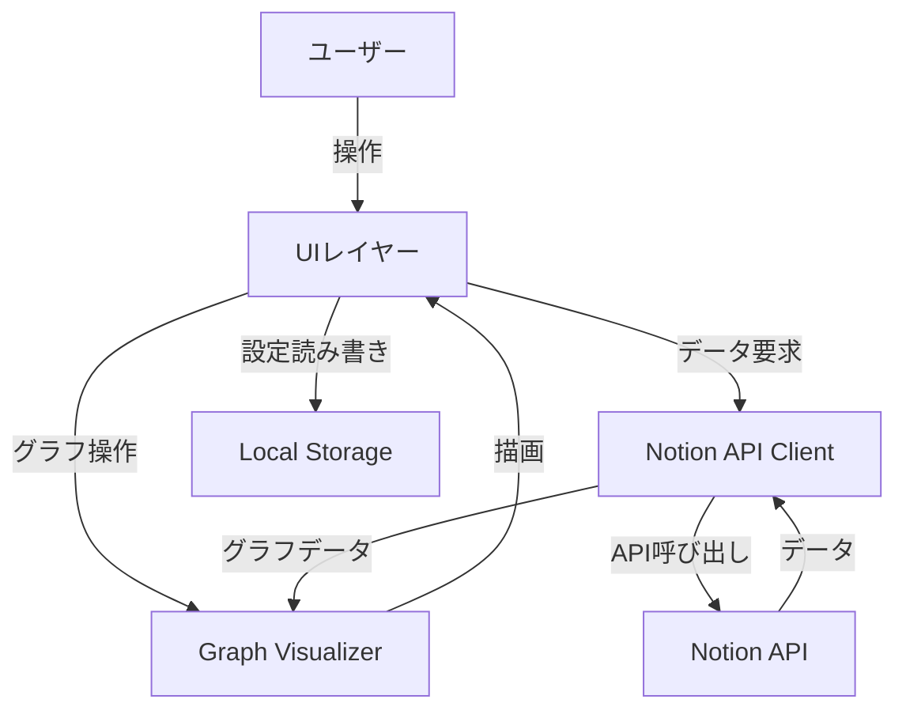

# 設計書

## 概要

notion-relation-viewは、Notionのページ間のリレーションを視覚的なグラフとして表示するWebアプリケーションです。本システムは、Notion APIを通じてページとリレーションデータを取得し、インタラクティブなグラフビューとして描画します。

### 主要な設計決定

1. **Webアプリケーションアーキテクチャ**: NotionのEmbed機能を活用し、すべてのプラットフォーム（Web、デスクトップ、モバイル）で動作するWebアプリケーションとして実装します。

2. **クライアントサイドレンダリング**: すべてのデータ処理とグラフ描画をブラウザ内で実行し、サーバーサイドの複雑性を排除します。

3. **グラフ描画ライブラリ**: 高性能なグラフ可視化のため、既存のライブラリ（例：D3.js、Cytoscape.js、vis.js）を使用します。

4. **ローカルストレージ**: APIトークンとユーザー設定をブラウザのlocalStorageに保存し、セッション間で永続化します。これにより、ユーザーは毎回トークンを入力する必要がなくなります。トークンはブラウザ内にのみ保存され、サーバーには送信されないため、セキュリティリスクを最小限に抑えられます。

5. **Notion Integration Token**: ユーザーはNotion Integration（インテグレーション）を作成し、そのIntegration Tokenをアプリケーションに入力します。アプリケーション起動時に設定画面が表示され、ユーザーはトークンを入力・保存できます。

## アーキテクチャ

### システム構成



### レイヤー構成

1. **UIレイヤー**: ユーザーインターフェース、イベントハンドリング、状態管理
2. **Graph Visualizerレイヤー**: グラフのレンダリング、レイアウト計算、インタラクション処理
3. **API Clientレイヤー**: Notion APIとの通信、データ変換、エラーハンドリング
4. **Storageレイヤー**: ローカルデータの永続化と取得

## コンポーネントとインターフェース

### 1. Notion API Client

**責務**: Notion APIとの通信を管理し、ページとリレーションデータを取得する

**主要メソッド**:

```typescript
interface NotionAPIClient {
  // APIトークンを検証し、接続を確立
  authenticate(token: string): Promise<AuthResult>

  // すべてのアクセス可能なデータベースを取得
  getDatabases(): Promise<Database[]>

  // 指定されたデータベースからページを取得
  getPages(databaseId: string): Promise<Page[]>

  // ページのリレーションプロパティを解析
  extractRelations(page: Page): Relation[]

  // バッチ処理でページデータを取得
  fetchPagesInBatch(pageIds: string[]): Promise<Page[]>
}
```

**エラーハンドリング**:
- 無効なトークン: `InvalidTokenError`
- ネットワークエラー: `NetworkError`
- レート制限: `RateLimitError`
- 権限不足: `PermissionError`

### 2. Graph Visualizer

**責務**: グラフの描画、レイアウト、インタラクション処理

**主要メソッド**:

```typescript
interface GraphVisualizer {
  // グラフデータを初期化し、レイアウトを計算
  initialize(nodes: Node[], edges: Edge[]): void

  // グラフを描画
  render(): void

  // ノードの位置を更新
  updateNodePosition(nodeId: string, x: number, y: number): void

  // ビューをパン
  pan(deltaX: number, deltaY: number): void

  // ズームレベルを設定
  zoom(level: number): void

  // ノードをハイライト
  highlightNodes(nodeIds: string[]): void

  // 特定のノードにビューを中央揃え
  centerOnNode(nodeId: string): void

  // ノードとエッジの表示/非表示を切り替え
  setVisibility(nodeIds: string[], visible: boolean): void
}
```

**レイアウトアルゴリズム**:
- Force-directed layout（力指向グラフ）を使用
- ノード間の反発力とエッジの引力でバランスを取る
- 大規模グラフの場合は階層的レイアウトも検討

### 3. UI Controller

**責務**: ユーザーインターフェースの管理、イベント処理、状態管理

**主要メソッド**:

```typescript
interface UIController {
  // アプリケーションを初期化
  initialize(): Promise<void>

  // APIトークン入力を処理
  handleTokenInput(token: string): Promise<void>

  // データ取得を開始
  fetchData(): Promise<void>

  // 検索クエリを処理
  handleSearch(query: string): void

  // データベースフィルターを適用
  applyDatabaseFilter(databaseIds: string[], hide: boolean): void

  // ノードクリックを処理
  handleNodeClick(nodeId: string): void

  // 進行状況を表示
  showProgress(current: number, total: number): void

  // エラーを表示
  showError(error: Error): void
}
```

**トークン設定フロー**:
1. アプリケーション起動時、保存されたトークンがない場合は設定画面を表示
2. ユーザーはNotion Integrationページ（https://www.notion.so/my-integrations）でIntegrationを作成
3. 作成したIntegrationのInternal Integration Tokenをコピー
4. アプリケーションの設定画面にトークンを貼り付けて保存
5. トークンはlocalStorageに保存され、次回起動時に自動的に使用される

### 4. Storage Manager

**責務**: ローカルストレージへのデータ永続化

**主要メソッド**:

```typescript
interface StorageManager {
  // APIトークンを保存
  saveToken(token: string): void

  // APIトークンを取得
  getToken(): string | null

  // ビュー設定を保存
  saveViewSettings(settings: ViewSettings): void

  // ビュー設定を取得
  getViewSettings(): ViewSettings | null

  // 非表示データベースリストを保存
  saveHiddenDatabases(databaseIds: string[]): void

  // 非表示データベースリストを取得
  getHiddenDatabases(): string[]
}
```

## データモデル

### Node（ノード）

```typescript
interface Node {
  id: string              // NotionページID
  title: string           // ページタイトル
  databaseId: string      // 所属するデータベースID
  x: number              // グラフ上のX座標
  y: number              // グラフ上のY座標
  visible: boolean       // 表示/非表示フラグ
}
```

### Edge（エッジ）

```typescript
interface Edge {
  id: string              // エッジの一意ID
  sourceId: string        // 始点ノードID
  targetId: string        // 終点ノードID
  relationProperty: string // リレーションプロパティ名
  visible: boolean       // 表示/非表示フラグ
}
```

### Database（データベース）

```typescript
interface Database {
  id: string              // データベースID
  title: string           // データベース名
  hidden: boolean         // 非表示フラグ
}
```

### Page（Notionページ）

```typescript
interface Page {
  id: string              // ページID
  title: string           // ページタイトル
  databaseId: string      // 所属するデータベースID
  properties: Property[]  // ページプロパティ
}
```

### Relation（リレーション）

```typescript
interface Relation {
  sourcePageId: string    // リレーション元ページID
  targetPageId: string    // リレーション先ページID
  propertyName: string    // リレーションプロパティ名
}
```

### ViewSettings（ビュー設定）

```typescript
interface ViewSettings {
  zoomLevel: number       // ズームレベル
  panX: number           // パン位置X
  panY: number           // パン位置Y
  hiddenDatabases: string[] // 非表示データベースIDリスト
}
```

### AuthResult（認証結果）

```typescript
interface AuthResult {
  success: boolean        // 認証成功フラグ
  workspaceName?: string  // ワークスペース名
  error?: string         // エラーメッセージ
}
```


## 正確性プロパティ

プロパティとは、システムのすべての有効な実行において真であるべき特性や動作のことです。本質的には、システムが何をすべきかについての形式的な記述です。プロパティは、人間が読める仕様と機械で検証可能な正確性保証との橋渡しとなります。

### プロパティ1: トークン検証の一貫性

*任意の*文字列入力に対して、有効なNotion APIトークンであれば認証が成功し、無効なトークンであればエラーが返される

**検証対象: 要件 1.1, 1.3**

### プロパティ2: エラーハンドリングの完全性

*任意の*APIエラー（ネットワークエラー、レート制限、権限エラー）に対して、システムはエラーをログに記録し、適切なエラーメッセージを返す

**検証対象: 要件 1.4, 7.3, 7.4, 7.5**

### プロパティ3: ページデータ取得の完全性

*任意の*Notionワークスペースに対して、アクセス可能なすべてのページを取得し、各ページのリレーションプロパティを正しく識別する

**検証対象: 要件 2.1, 2.2, 2.3**

### プロパティ4: 孤立ノードの処理

*任意の*リレーションプロパティを持たないページに対して、システムはそのページを孤立ノードとしてグラフに含める

**検証対象: 要件 2.5**

### プロパティ5: グラフ構造の完全性

*任意の*ページとリレーションのセットに対して、すべてのページがノードとして生成され、すべてのリレーションがエッジとして生成され、各ノードには正しいタイトルが含まれる

**検証対象: 要件 3.1, 3.2, 3.3**

### プロパティ6: レイアウトアルゴリズムの実行

*任意の*グラフデータに対して、レイアウトアルゴリズムを適用すると、すべてのノードに有効な座標（x, y）が割り当てられる

**検証対象: 要件 3.4**

### プロパティ7: ノードクリック時のURL生成

*任意の*ノードに対して、クリック時に生成されるURLは正しいNotionページURLの形式である

**検証対象: 要件 4.1**

### プロパティ8: ノード位置更新の一貫性

*任意の*ノードと新しい座標に対して、ノードをドラッグすると、そのノードの位置が新しい座標に更新される

**検証対象: 要件 4.2**

### プロパティ9: ビューパンの一貫性

*任意の*パン操作（deltaX, deltaY）に対して、ビューの位置が指定された量だけ移動する

**検証対象: 要件 4.3**

### プロパティ10: ズーム操作の一貫性

*任意の*ズーム操作に対して、ズームレベルが指定された値に更新される

**検証対象: 要件 4.4**

### プロパティ11: 検索機能の正確性

*任意の*検索クエリに対して、ノードタイトルにクエリが含まれるすべてのノードが検索結果に含まれ、含まれないノードは結果に含まれない

**検証対象: 要件 5.1**

### プロパティ12: 検索結果の中央揃え

*任意の*検索結果に対して、最初に一致したノードの座標がビューの中心座標として設定される

**検証対象: 要件 5.2**

### プロパティ13: データベースフィルタリングの正確性

*任意の*データベースIDのセットに対して、それらのデータベースを非表示にすると、そのデータベースに属するすべてのノードとそれらに接続されたエッジが非表示になる

**検証対象: 要件 5.4, 5.5**

### プロパティ14: フィルタークリアのラウンドトリップ

*任意の*グラフ状態に対して、データベースを非表示にしてから非表示設定をクリアすると、元のグラフ状態（すべてのノードとエッジが表示）に戻る

**検証対象: 要件 5.6**

### プロパティ15: トークン保存のラウンドトリップ

*任意の*APIトークン文字列に対して、ローカルストレージに保存してから取得すると、同じトークン文字列が返される

**検証対象: 要件 6.1**

### プロパティ16: ビュー設定保存のラウンドトリップ

*任意の*ビュー設定（ズームレベル、パン位置）に対して、ローカルストレージに保存してから取得すると、同じ設定値が返される

**検証対象: 要件 6.3, 6.4**

### プロパティ17: バッチ処理の最適化

*任意の*ページIDのリストに対して、バッチ処理を使用すると、API呼び出し回数が個別リクエストよりも少なくなる

**検証対象: 要件 8.4**

## エラーハンドリング

### エラーの種類と処理

1. **認証エラー**
   - 無効なAPIトークン: ユーザーにトークン再入力を促す
   - 権限不足: アクセスできないリソースを明示

2. **ネットワークエラー**
   - 接続失敗: 再試行オプションを提供
   - タイムアウト: 進行状況を保存し、再開可能にする

3. **APIエラー**
   - レート制限: 待機時間を表示し、自動再試行
   - 無効なリクエスト: エラー詳細をログに記録

4. **データエラー**
   - 不正なデータ形式: デフォルト値を使用し、警告を表示
   - 欠損データ: 部分的なデータで動作を継続

### エラーログ

すべてのエラーは以下の情報とともにコンソールログに記録されます：
- タイムスタンプ
- エラーの種類
- エラーメッセージ
- スタックトレース（該当する場合）
- コンテキスト情報（API呼び出しのパラメータなど）

## テスト戦略

### デュアルテストアプローチ

本システムのテストは、ユニットテストとプロパティベーステストの両方を使用します。これらは相補的であり、包括的なカバレッジを実現するために両方が必要です。

- **ユニットテスト**: 特定の例、エッジケース、エラー条件を検証
- **プロパティベーステスト**: すべての入力にわたる普遍的なプロパティを検証

### プロパティベーステスト

**テストライブラリ**: JavaScriptの場合は`fast-check`を使用

**設定**:
- 各プロパティテストは最低100回の反復を実行
- 各テストには設計書のプロパティを参照するタグを付ける
- タグ形式: `Feature: notion-relation-view, Property {番号}: {プロパティテキスト}`

**テスト対象**:
- トークン検証（プロパティ1）
- エラーハンドリング（プロパティ2）
- データ取得と変換（プロパティ3, 4）
- グラフ構造生成（プロパティ5, 6）
- インタラクション処理（プロパティ7-12）
- フィルタリング機能（プロパティ13, 14）
- データ永続化（プロパティ15, 16）
- バッチ処理最適化（プロパティ17）

### ユニットテスト

**テストフレームワーク**: Jest

**テスト対象**:
- 特定のエッジケース（空のデータベース、リレーションのないページ）
- エラー条件（無効なトークン、ネットワーク障害）
- 統合ポイント（コンポーネント間のデータフロー）
- 具体的な例（特定のNotion APIレスポンス形式）

**テストバランス**:
- ユニットテストは特定の例とエッジケースに焦点を当てる
- プロパティベーステストが多数の入力をカバーするため、過度なユニットテストは避ける
- 統合テストは主要なユーザーフローを検証

### テストカバレッジ目標

- コードカバレッジ: 80%以上
- すべての正確性プロパティに対応するプロパティベーステスト
- 各エラーハンドリングパスに対するユニットテスト
- 主要なユーザーフローに対する統合テスト

### 継続的テスト

- すべてのコミット前にテストを実行
- CI/CDパイプラインでの自動テスト実行
- プロパティベーステストの失敗時は、失敗した入力を記録し、回帰テストに追加
