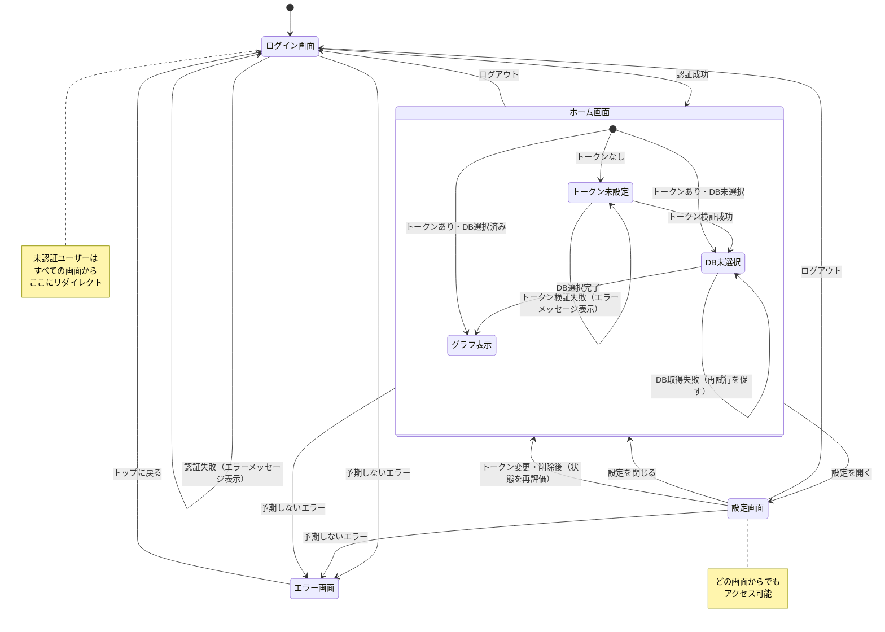

# プロダクト要件定義書（PRD）

## 1. 概要

### プロダクト名

Notion Relation View

### 課題

Notionにはページ間のリレーションを可視化する機能がない。
Obsidianにはグラフビューがあり、ナレッジの繋がりを俯瞰できるが、
Notionユーザーには同等の手段がない。そのため、ページやデータベースが
どのように関連しているかの全体像を把握することが難しい。

### ソリューション

ユーザーのNotionワークスペースに接続し、ページ間のリレーションを
インタラクティブなグラフとして可視化するWebアプリケーション。
リレーションプロパティを通じたページ間の繋がりを確認し、
グラフを操作して、元のNotionページへ直接遷移できる。

### ターゲットユーザー

- リレーションプロパティを使ってデータベース間でページをリンクしているNotionユーザー
- ワークスペース内の構造や繋がりを把握したいユーザー

### リリースモデル

フリーミアム（無料プラン＋有料プラン）。料金やプラン制限の詳細は後日定義する。

### 想定規模

約100ユーザー。

## 2. 機能の優先度

### Must Have（MVP）

| ID | 機能 | 説明 |
|----|------|------|
| M1 | ユーザー認証 | Google OIDCによるログイン |
| M2 | Notion連携 | インテグレーショントークンによるNotionワークスペースへの接続 |
| M3 | データベース選択 | ワークスペース内のデータベース一覧を表示し、可視化対象をユーザーが選択 |
| M4 | リレーションプロパティの可視化 | 選択されたデータベースからリレーションプロパティを抽出し、グラフとして表示 |
| M5 | グラフ操作 - ズーム | グラフの拡大・縮小 |
| M6 | グラフ操作 - ドラッグ | ノードをドラッグしてレイアウトを変更 |
| M7 | グラフ操作 - クリックで遷移 | ノードをクリックして対応するNotionページを新しいタブで開く |

### Should Have

| ID | 機能 | 説明 |
|----|------|------|
| S1 | メンションの可視化 | ページ内の@ページメンションを抽出し、グラフのエッジとして表示 |
| S2 | データベースフィルタリング | データベース単位でグラフをフィルタリングし、特定の範囲に絞って表示 |
| S3 | ダークモード | ライト/ダークテーマ対応、システム設定の自動検出 |

### Could Have

| ID | 機能 | 説明 |
|----|------|------|
| C1 | ビューの保存・共有 | グラフの設定を保存し、URLで共有 |
| C2 | 検索 | ページタイトルでノードを検索し、グラフ内で該当ノードに移動 |
| C3 | プラン管理 | フリーミアムのプラン適用（無料枠の制限、有料機能） |

### Won't Have（今回は対象外）

| ID | 機能 | 説明 |
|----|------|------|
| W1 | モバイル対応 | モバイルデバイス向けレスポンシブデザイン |
| W2 | リアルタイム同期 | Notionのコンテンツ変更時の自動更新 |
| W3 | 複数ワークスペース対応 | 複数のNotionワークスペースの同時利用 |

## 3. 受入基準

### Must Have（MVP）

#### M1: ユーザー認証

- Googleアカウントでログインできる
- ログイン後、ユーザー情報（名前、メールアドレス）が表示される
- ログアウトするとセッションが無効になり、ログイン画面に戻る
- 無効な認証情報ではログインできず、エラーメッセージが表示される

#### M2: Notion連携

- Notionインテグレーショントークンを入力して保存できる
- 有効なトークンの場合、ワークスペースへの接続が成功する
- 無効なトークンの場合、エラーメッセージが表示される
- トークンは暗号化されて保存される

#### M3: データベース選択

- ワークスペース内のデータベース一覧が表示される
- 1つ以上のデータベースを選択できる
- 選択せずに進もうとするとエラーが表示される
- データベースが1つも存在しない場合、その旨のメッセージが表示される

#### M4: リレーションプロパティの可視化

- 選択したデータベースのページがノードとして表示される
- リレーションプロパティがエッジとして表示される
- リレーションのないページも孤立ノードとして表示される
- ノードにはページタイトルが表示される

#### M5: グラフ操作 - ズーム

- マウスホイールまたはピンチ操作でグラフの拡大・縮小ができる
- ズームレベルに最小値・最大値がある

#### M6: グラフ操作 - ドラッグ

- ノードをドラッグして位置を変更できる
- ドラッグ中にエッジが追従して再描画される
- グラフ全体をドラッグしてパン（視点移動）できる

#### M7: グラフ操作 - クリックで遷移

- ノードをクリックすると対応するNotionページが新しいタブで開く
- URLはNotionの正しいページURLである

### Should Have

#### S1: メンションの可視化

- ページ内の@ページメンションがエッジとして表示される
- リレーションプロパティのエッジとメンションのエッジが視覚的に区別できる
- メンションとリレーションが同じページを指す場合、重複エッジにならない

#### S2: データベースフィルタリング

- グラフ表示後にデータベース単位で表示/非表示を切り替えられる
- フィルタリング後もグラフのレイアウトが崩れない
- フィルタを解除すると元の表示に戻る

#### S3: ダークモード

- ライト/ダークテーマを手動で切り替えられる
- システムのテーマ設定を自動検出して初期テーマが決まる
- テーマ設定がブラウザに保存され、再訪時に復元される

## 4. ユーザーフロー

1. Googleアカウントでログインする
2. Notionインテグレーショントークンを入力する
3. アプリがワークスペース内のデータベース一覧を取得する
4. ユーザーが可視化したいデータベースを1つ以上選択する
5. アプリが選択されたデータベースからリレーションプロパティを抽出する
6. ページをノード、リレーションをエッジとしてグラフが表示される
7. ユーザーがグラフを操作する（ズーム、ドラッグ、クリックでページ遷移）

## 5. 画面

### 画面一覧

| 画面 | 説明 |
|------|------|
| ログイン画面 | Googleログインボタンを表示 |
| ホーム画面 | ユーザーの設定状態に応じた表示を切り替えるメイン画面。トークン未設定時はトークン設定への誘導、DB未選択時はDB選択の促し、設定完了時はグラフを表示 |
| 設定画面 | トークンの変更・削除など、Notion連携設定を管理 |
| グラフ表示画面 | リレーショングラフの表示・操作 |
| エラー画面 | 予期しないエラー発生時のメッセージ表示 |

### ホーム画面の状態分岐

| 状態 | 表示内容 |
|------|----------|
| トークン未設定 | Notionインテグレーショントークンの入力フォームと設定ガイドを表示 |
| トークン設定済み・DB未選択 | ワークスペース内のDB一覧を表示し、可視化対象の選択を促す |
| 設定完了（トークン・DB選択済み） | グラフ表示画面を表示 |

### 遷移図

## 6. 非機能要件

| カテゴリ | 要件 |
|---------|------|
| パフォーマンス | 500ページまでのグラフを3秒以内に描画 |
| セキュリティ | Notionトークンは保存時に暗号化。ユーザーデータは他のユーザーに公開しない |
| 可用性 | 一般的なWebアプリケーション水準（MVPでは厳密なSLAなし） |
| ブラウザ対応 | Chrome、Firefox、Safari、Edgeの最新版 |
